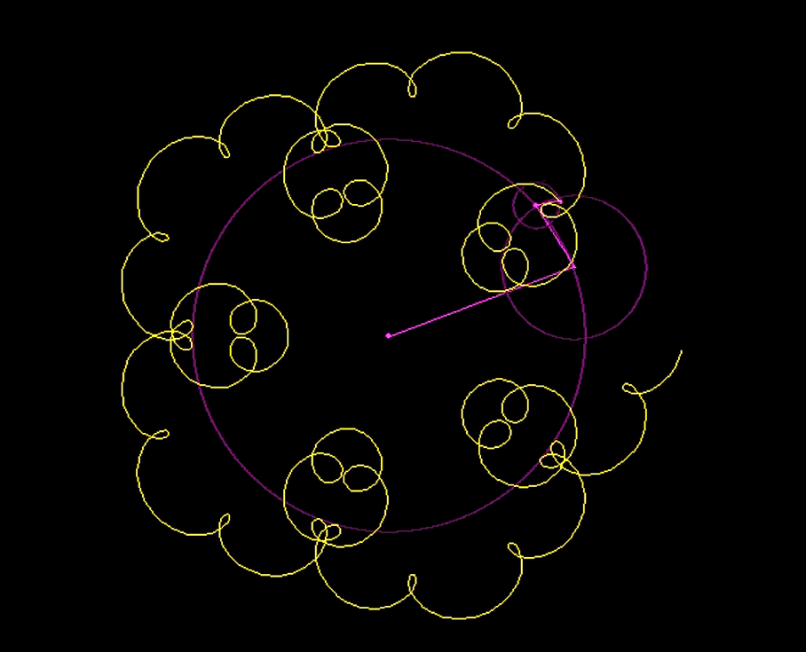
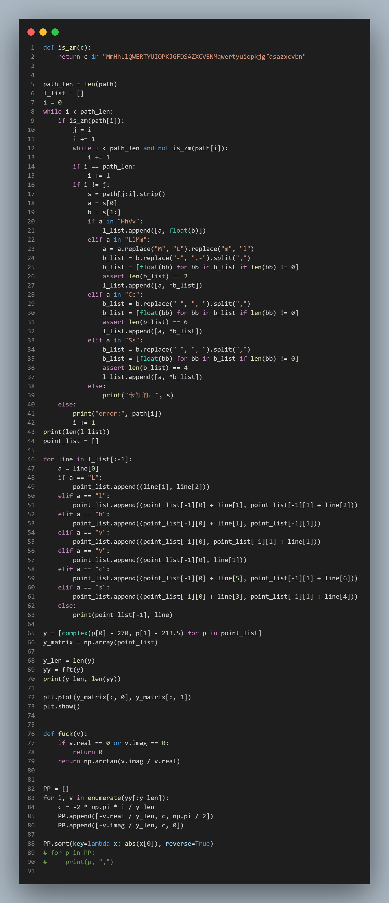

# Quiz8
studentname: JoeyWang<br>
Unikey: ywan8892 <br>
## part1:
The image technique I have chosen is based on the ```Fourier transform```of a plotting function. It started when I saw a drawing like this on a video site</br>
<br>
This drawing uses multiple trajectory circles to draw a simple graph. After some searching, I found that this method utilises the Fourier Transform and the end result can even look something like this<br>
<br>
The Fourier transform expresses all other functions using the sine and cosine functions. And in the assignment, almost all graphs have well-defined boundaries, which means that these graphs will have trajectory expressions about their boundaries. In other words, I can use the Fourier transform to fit the boundary trajectories of these pictures nearly perfectly<br>

## part2:
In the code section, I refer to an existing file on github for drawing graphs based on the Fourier transform, screenshot below.<br>
<br>
This code uses ```python```to draw graphs based on Fourier transform. Also compared to other recommended Fourier transform based drawing methods, this method does not need to use ```edge detection algorithm``` to process the original image. Instead, the path is generated by ```SVG``` and added to the code, which makes it much less difficult to implement.<br>